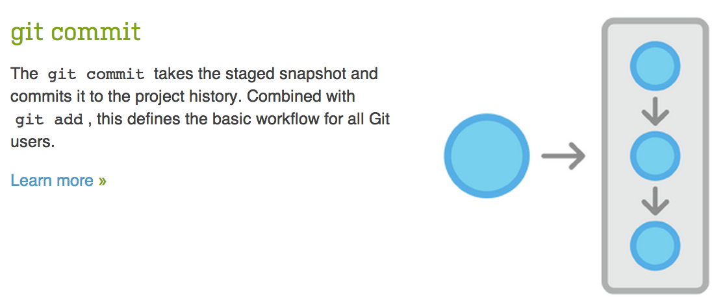
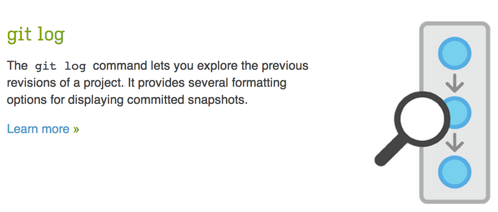
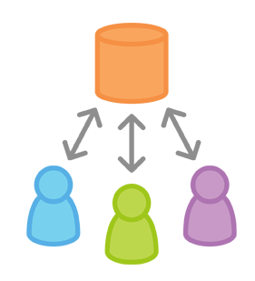
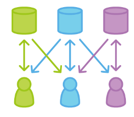
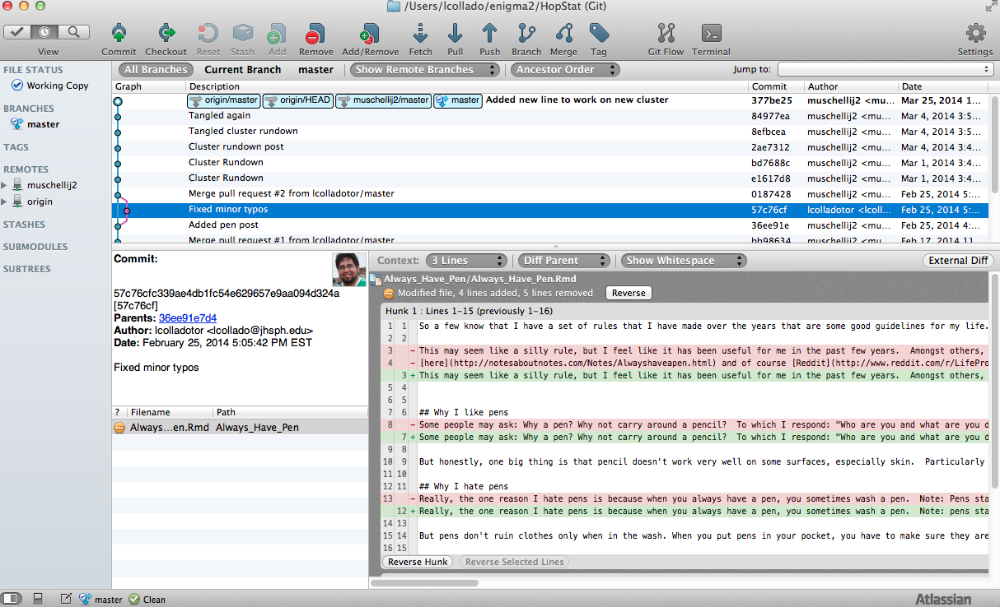
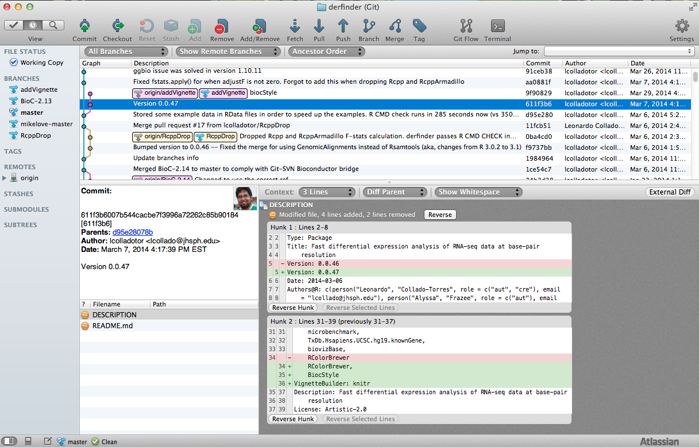
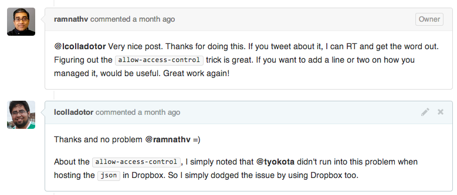
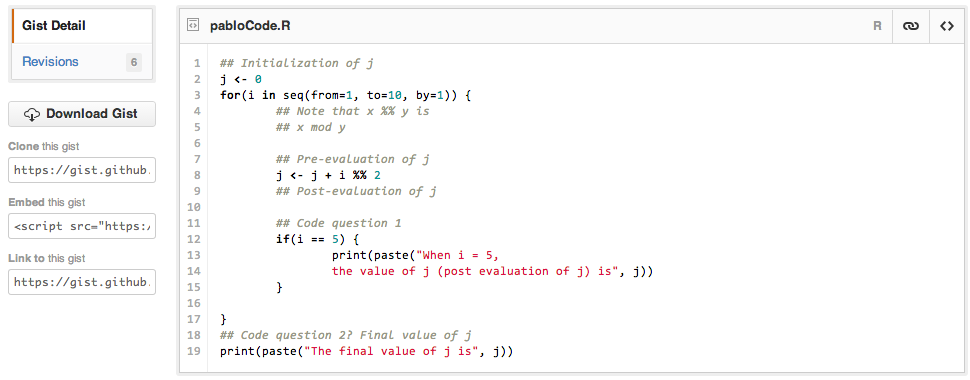

Git for research
========================================================
author: L. Collado-Torres
date: 2014-04-03
font-import: http://fonts.googleapis.com/css?family=Gilda+Display
font-family: 'Gilda Display'

View this presentation
======================

http://lcolladotor.github.io/git-for-research/

or

http://bit.ly/GitResearch

Version control
===============
type: section

How do you version control?
========================================================
incremental: true

- Do nothing, hope for the best!
- Mark them as old, new
- Store files in a different directory
- Append a \_v1, \_v2, etc to the file name
- Add the date, for example: 2012\_9\_11\_class.pdf
- Use Dropbox, Google Drive, Google Docs, ShareLatex or something else to manage the files.

Why use a version control system?
=================================
incremental: true

- Good organization can save a lot of time!
- Clean directory
- Best for collaborating with others: specially if you are working on the same file
- Good project development practice
- Helps share & reproduce

Git
===
incremental: true

- It's a distributed version control system (DVCS)
- The most used system: `subversion` uses `git` for their code!
- Highly popular thanks to [GitHub](https://github.com/)

Git basics
==========
type: section

git init
========

[Source](https://www.atlassian.com/git/tutorial/git-basics#!overview)

git clone
=========

[Source](https://www.atlassian.com/git/tutorial/git-basics#!overview)

git config
==========

[Source](https://www.atlassian.com/git/tutorial/git-basics#!overview)

git add
=======

[Source](https://www.atlassian.com/git/tutorial/git-basics#!overview)

git commit
==========

[Source](https://www.atlassian.com/git/tutorial/git-basics#!overview)

git status
==========

[Source](https://www.atlassian.com/git/tutorial/git-basics#!overview)

git log
=======

[Source](https://www.atlassian.com/git/tutorial/git-basics#!overview)

Using git
=========
type: section

SourceTree
==========

Get it from http://www.sourcetreeapp.com/

Central workflow
================

[Source](https://www.atlassian.com/git/workflows)

Fork + pull request
===================

***

***
[Source](https://www.atlassian.com/git/workflows)

Example: HopStat post
=====================

Branches for features
=====================

[Source](https://www.atlassian.com/git/workflows)

Example: derfinder
=====================

GitHub
======
type: section

Overview
========

Share code
==========

Via a repository
- One or more authors
- Issues and bug tracking
- Allows multiple branches

***

Via a gist
- One author
- Very quick: copy and paste

***

Both allow forking + comments

Issues and bug tracking
===============================================

[knitrBootstrap](https://github.com/jimhester/knitrBootstrap) example

[Source](https://github.com/jimhester/knitrBootstrap/issues?state=open)

rMaps example
=============

Great way to figure out how to do something with other great people!
- 28 comments + 4 people involved

[Source](https://github.com/ramnathv/rMaps/issues/6)

A gist example
==============

[Source](https://gist.github.com/lcolladotor/8203492)

A gist example: revisions
=========================

[Source](https://gist.github.com/lcolladotor/8203492)

Host your R package
===================

[devtools](http://cran.r-project.org/web/packages/devtools/index.html) makes it easy to share code via GitHub (and others)

[Source](https://github.com/lcolladotor/derfinder)

Open source report card
=======================

[Source](http://osrc.dfm.io/lcolladotor)

How to get started
==================
incremental: true

- https://www.atlassian.com/git/tutorial/
- http://gitimmersion.com/
- http://git-scm.com/book
- My [previous presentation](https://bitbucket.org/lcolladotor/html_git_intro) about Git 

Where to host?
- [GitHub](https://github.com) offers 5 private repos to .edu accounts
- [Bitbucket](https://bitbucket.org) offers unlimited private repos to .edu accounts
- Can use GitHub login info for Bitbucket (including ssh keys)

